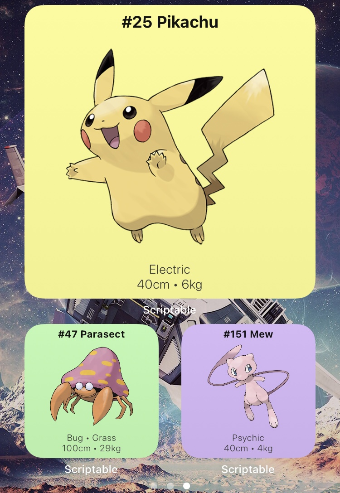

# Pokémon Of The Day
Scriptable iOS Widget to display a new random Pokémon every day

## Installation

* Download Scriptable App for iOS Devices - https://scriptable.app
* Download/Import of `PokemonOfTheDay.js` File to `iCloud/Scriptable`
* Create new Scriptable Widget on the Homescreen and choose script `Pokemon of the Day`

## Features

&nbsp;

- Name, Image, Types, Height and Weight fetched from https://pokeapi.co
- Background color based on type
- English and German language
- Links to Bulbapedia/PokéWiki when widget is opened in app
- Optimized for large and small widgets; Layouts and Scales tested on iPhone 8

## Usage
* Best set `When Interacting` to `Run Script`

### Parameter 

`[MAX_ID[;UPDATE_INTERVAL]]`

#### MAX_ID (optional)
Set maximum id of Pokémon to choose from randomly 
   
Default is `898`.
     
E.g. set to 151 to only choose from Generation I
     
Use Value `#<ID>` to permanently display your favourite Pokémon from `001`-`898`.

#### UPDATE_INTERVAL (OPTIONAL)
Set the update Interval in hours `[1-24]`. 

Default is `24`.

#### Examples

&nbsp;

`151`: Display a new random Pokémon from the first 151 every day

`151;8`: Display a new random Pokémon from the first 151 every 8 hours

`#25`: Display Pikachu permanently

`;1`: Display a new random Pokémon every hour

## Please Note
The script caches Pokémon data and images in directory `iCloud\scriptable`
